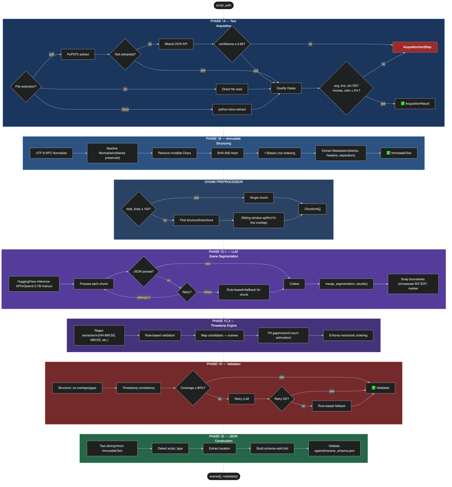
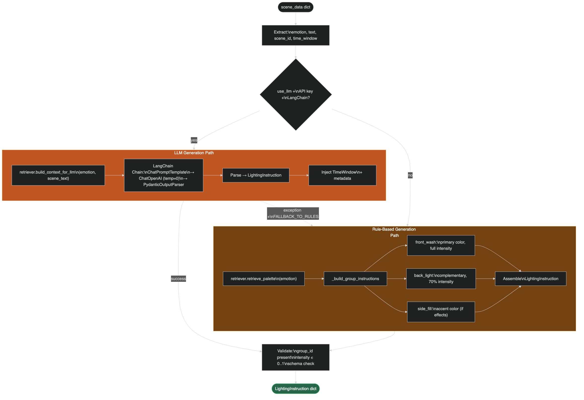
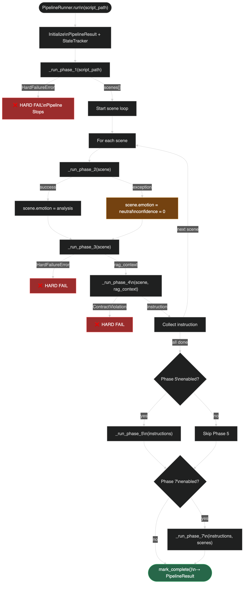
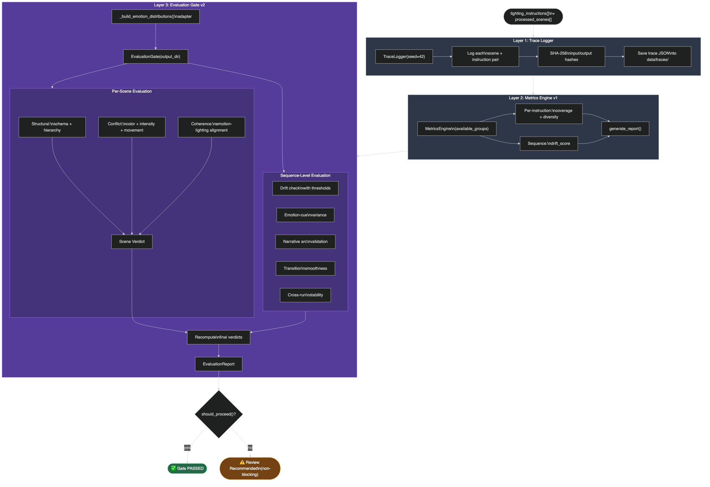

<h1 align="center">🎭 Lumina Intelligence — Automated Auditorium Lighting using GenAI</h1>

<p align="center">
  <b>Full-Stack Generative AI System with 8-Phase Pipeline, RAG Integration, and Real-Time 3D Visualization for Automated Theatrical Lighting Production</b>
</p>

<p align="center">
  
  
  
  
  
  
</p>

---

## 📋 Table of Contents

- [Overview](#overview)
- [Key Features](#key-features)
- [System Architecture](#system-architecture)
- [Pipeline Phases](#pipeline-phases)
- [Tech Stack](#tech-stack)
- [Getting Started](#getting-started)
- [Usage](#usage)
- [Frontend UI](#frontend-ui)
- [API Reference](#api-reference)
- [Evaluation & Metrics](#evaluation--metrics)
- [Project Structure](#project-structure)
- [Configuration](#configuration)
- [Research Context](#research-context)
- [Future Roadmap](#future-roadmap)
- [Contributing](#contributing)
- [License](#license)

---

## Overview

**Lumina Intelligence** is a full-stack AI system that automates theatrical lighting design for auditorium performances. Given a play script (`.txt`, `.pdf`, or `.docx`), the system:

1. **Parses and segments** the script into discrete scenes using LLM-powered segmentation
2. **Analyzes emotional content** per scene using a multi-head ML pipeline (DistilRoBERTa + Graph RAG)
3. **Retrieves contextual knowledge** from a dual FAISS-based RAG system (auditorium fixtures + lighting semantics)
4. **Generates precise lighting instructions** via a hybrid rule-based + LLM decision engine
5. **Visualizes results** in a real-time 3D Three.js simulation
6. **Evaluates output quality** through an 8-check validation gate with quantitative metrics
7. **Exports DMX-compatible data** for hardware execution on professional lighting consoles

The system replaces hours of manual lighting design work by a trained technician, producing emotionally coherent, technically valid lighting cue sheets in under 60 seconds.

---

## Key Features

| Feature | Description |
|---------|-------------|
| 🎬 **Multi-Format Script Ingestion** | Supports `.txt`, `.pdf` (OCR via Mistral), and `.docx` input formats |
| 🧠 **Multi-Head Emotion Analysis** | DistilRoBERTa-based emotion detection with Graph RAG cross-scene context |
| 💡 **Hybrid Lighting Engine** | Dual-mode: deterministic rule-based baseline + LLM-enhanced creative generation |
| 🔍 **Dual RAG Retrieval** | FAISS vector search over 54 auditorium fixture documents + 7 lighting semantics rules |
| 🎮 **3D Visualization** | Real-time Three.js auditorium simulation with WebSocket-driven cue playback |
| 📊 **8-Check Evaluation Gate** | Schema, hardware limits, conflict resolution, stability, drift, confidence, narrative, coherence |
| 🎛️ **DMX/OSC Hardware Bridge** | Phase 8 adapters for Art-Net, LightKey OSC, and MIDI control |
| 🌐 **Full-Stack Web App** | React + Vite frontend with real-time WebSocket progress tracking |
| 📝 **NLP Lighting Commands** | Natural language parser for live lighting adjustments ("dim the front wash to 50%") |
| 🔄 **RLHF Feedback Loop** | Human feedback collection for reinforcement learning improvement |

---

## System Architecture

The system follows a **modular 8-phase pipeline architecture**, where each phase is a self-contained module with strict interface contracts:

```
                    ┌─────────────────────────────────────┐
                    │        Frontend (React/Vite)        │
                    │   Landing → Upload → Processing →   │
                    │        Results Dashboard            │
                    └──────────────┬──────────────────────┘
                                   │ REST + WebSocket
                    ┌──────────────▼──────────────────────┐
                    │    Backend (FastAPI + Uvicorn)       │
                    │    WebSocket Manager + API Routes    │
                    └──────────────┬──────────────────────┘
                                   │
    ┌──────────────────────────────▼──────────────────────────────┐
    │                  Phase 6: Pipeline Orchestrator              │
    │                                                              │
    │  ┌──────────┐  ┌──────────┐  ┌──────────┐  ┌──────────┐   │
    │  │ Phase 1  │→ │ Phase 2  │→ │ Phase 3  │→ │ Phase 4  │   │
    │  │ Script   │  │ Emotion  │  │   RAG    │  │ Lighting │   │
    │  │ Parsing  │  │ Analysis │  │ Retrieval│  │  Engine  │   │
    │  └──────────┘  └──────────┘  └──────────┘  └──────────┘   │
    │       │                                          │          │
    │  ┌────▼─────┐                              ┌────▼─────┐   │
    │  │ Phase 0  │                              │ Phase 5  │   │
    │  │Contracts │                              │Simulation│   │
    │  │ (Schema) │                              │ (3D Viz) │   │
    │  └──────────┘                              └────┬─────┘   │
    │                                                  │          │
    │                    ┌──────────┐             ┌────▼─────┐   │
    │                    │ Phase 8  │             │ Phase 7  │   │
    │                    │ Hardware │◄────────────│Evaluation│   │
    │                    │(DMX/OSC) │             │ Metrics  │   │
    │                    └──────────┘             └──────────┘   │
    └─────────────────────────────────────────────────────────────┘
```

---

## Pipeline Phases

### Phase 0 — Contracts (`contracts/`)
> **JSON schema definitions that lock the data interfaces between all phases.**

- `scene_schema.json` — Scene object structure
- `lighting_instruction_schema.json` — Lighting cue output format
- `fixture_schema.json` — Hardware fixture definitions
- `lighting_semantics_schema.json` — Semantic rule format

### Phase 1 — Script Parsing & Scene Extraction (`phase_1/`)
> **Converts raw scripts into structured, timestamped scene objects.**

| Module | Purpose |
|--------|---------|
| `text_acquisition.py` | Multi-format file reader (TXT, PDF via Mistral OCR, DOCX) |
| `chunk_preprocessor.py` | Intelligent text chunking with overlap for LLM processing |
| `llm_scene_segmenter.py` | LLM-powered scene boundary detection (Qwen 2.5-7B) |
| `immutable_structurer.py` | Converts raw segments into immutable scene objects |
| `scene_json_builder.py` | Builds validated JSON scene structures |
| `timestamp_engine.py` | Estimates temporal duration via words-per-minute model |
| `validation_layer.py` | Coverage validation, gap detection, schema compliance |
| `narrative_synthesizer.py` | Generates global narrative summary for sliding-window context |

<details>
<summary>📊 Phase 1 Architecture Diagram</summary>

</details>

### Phase 2 — Emotion Analysis (`phase_2/`)
> **ML-powered emotion detection with cross-scene narrative awareness.**

- **Primary Model**: `j-hartmann/emotion-english-distilroberta-base` — 7-class emotion classifier
- **Multi-Head Analyzer**: Parallel emotion, energy, and valence scoring
- **Graph RAG**: NetworkX-based scene graph for cross-scene emotional context propagation
- **Global Anchors**: Extracts dominant emotional themes across the full script

<details>
<summary>📊 Phase 2 Emotion Flow</summary>

</details>

### Phase 3 — RAG Knowledge Retrieval (`phase_3/`)
> **Dual FAISS vector database for contextual fixture and semantics retrieval.**

- **Auditorium Index**: 54 documents covering fixture specifications, positions, and capabilities
- **Lighting Semantics Index**: 7 expert rules mapping emotions → lighting design principles
- **Embedding Model**: `all-MiniLM-L6-v2` sentence transformer
- **Schema Validation**: JSON Schema enforcement on all knowledge documents

<details>
<summary>📊 Phase 3 RAG Pipeline</summary>

</details>

### Phase 4 — Lighting Decision Engine (`phase_4/`)
> **Hybrid rule-based + LLM lighting instruction generator.**

- **Rule-Based Mode**: Deterministic emotion-to-lighting mapping (5 fixture groups × intensity, color, transition, focus)
- **LLM Mode**: GPT-4 / Qwen / Llama via structured Pydantic output
- **V3 Override Hierarchy**: Manual overrides > LLM > RAG > Rules
- **Fallback Safety**: Automatic fallback from LLM to rules on failure

<details>
<summary>📊 Phase 4 Decision Flow</summary>

</details>

### Phase 5 — 3D Simulation & Visualization (`phase_5/`)
> **Real-time Three.js auditorium simulation.**

- WebSocket-driven cue playback engine
- Color utility conversion (named colors → RGB → hex)
- Scene rendering with fixture position mapping
- HTTP server for browser-based viewing (port 8081)

<details>
<summary>📊 Phase 5 Simulation Architecture</summary>

</details>

### Phase 6 — Pipeline Orchestration (`phase_6/`)
> **State machine that coordinates all phases with error handling and progress tracking.**

- Pipeline runner with WebSocket progress callbacks
- Configurable phase enable/disable
- Batch executor for multi-script processing
- Cue validation layer before output

<details>
<summary>📊 Phase 6 Orchestrator</summary>

</details>

### Phase 7 — Evaluation & Metrics (`phase_7/`)
> **Quantitative evaluation engine with 8-check validation gate.**

| Check | Code | What It Validates |
|-------|------|-------------------|
| Schema Integrity | `SCH` | Output matches required JSON structure |
| Hardware Limits | `HRD` | No fixture exceeds 100% intensity |
| Conflict Resolution | `CFT` | No contradictory fixture instructions |
| Sequence Stability | `STB` | No epileptic-risk rapid transitions |
| Value Drift | `DRF` | Smooth intensity changes between scenes |
| Pipeline Confidence | `CNF` | ML emotion confidence above threshold |
| Narrative Coherence | `NAR` | Emotion intent has physical manifestation |
| Frame Coherence | `COH` | Fixture groupings produce valid optical frame |

Additional metrics: **drift score**, **coverage**, **diversity**, **determinism**, **cross-run stability**

<details>
<summary>📊 Phase 7 Evaluation Pipeline</summary>

</details>

### Phase 8 — Hardware Execution (`phase_8/`)
> **DMX, OSC, and MIDI adapters for professional lighting consoles.**

- Art-Net DMX adapter for Avolites Titan consoles
- LightKey OSC integration for macOS-based rigs
- LightKey MIDI control for hardware faders
- Fixture mapping configuration files

---

## Tech Stack

### Backend
| Technology | Purpose |
|------------|---------|
| **Python 3.11** | Core language |
| **FastAPI** | REST API + WebSocket server |
| **PyTorch 2.0+** | ML model inference |
| **HuggingFace Transformers** | DistilRoBERTa emotion model, Qwen LLM |
| **FAISS** | Vector similarity search |
| **Sentence Transformers** | Text embeddings for RAG |
| **LangChain** | LLM chain orchestration |
| **NetworkX** | Graph RAG for cross-scene context |
| **Pydantic** | Data validation and structured output |
| **Mistral AI** | PDF OCR for script ingestion |

### Frontend
| Technology | Purpose |
|------------|---------|
| **React 19** | UI framework |
| **Vite 7** | Build tool and dev server |
| **Tailwind CSS 3** | Utility-first styling |
| **React Router 7** | Client-side routing |
| **Lucide React** | Icon library |
| **WebSocket** | Real-time progress updates |

### Hardware Integration
| Technology | Purpose |
|------------|---------|
| **Art-Net / sACN** | DMX512 over Ethernet |
| **python-osc** | OSC protocol for LightKey |
| **MIDI** | Hardware fader control |

---

## Getting Started

### Prerequisites

- **Python 3.11** (via Conda recommended)
- **Node.js 18+** and **npm**
- **Git**

### Installation

```bash
# 1. Clone the repository
git clone https://github.com/Hitesh-Prajapathi/Automated_Auditorium_Lighting.git
cd Automated_Auditorium_Lighting

# 2. Create and activate Conda environment
conda create -n venv_ALG_311 python=3.11 -y
conda activate venv_ALG_311

# 3. Install Python dependencies
pip install -r requirements.txt

# 4. Install frontend dependencies
cd frontend && npm install && cd ..

# 5. Set up environment variables
cp .env.example .env
# Edit .env with your API keys:
#   MISTRAL_API_KEY=your_key     (required for PDF OCR)
#   HF_API_TOKEN=your_token      (required for HuggingFace models)
#   OPENAI_API_KEY=your_key      (optional, for GPT-4 mode)
```

### Quick Launch

```bash
# Option 1: Use the launcher script (starts both backend + frontend)
conda activate venv_ALG_311
python launch.py

# Option 2: Start services individually
# Terminal 1 — Backend
conda activate venv_ALG_311
python -m uvicorn backend.app:app --host 0.0.0.0 --port 8000

# Terminal 2 — Frontend
cd frontend
npm run dev
```

Open **http://localhost:5173** in your browser.

---

## Usage

### Web Interface (Recommended)

1. **Open** `http://localhost:5173` — the Lumina Intelligence landing page
2. **Click** "Upload Script" to navigate to the upload page
3. **Drag & drop** or browse for a script file (`.txt`, `.pdf`, `.docx`)
4. **Select** pipeline mode:
   - **Multi-Stage** (default): Full 8-phase pipeline
   - **Single-Pass**: Experimental full-context mode
5. **Choose** LLM model:
   - `Rule-Based` — Deterministic baseline (no API key needed)
   - `Qwen/Qwen2.5-7B-Instruct` — HuggingFace inference
   - `GPT-4` — OpenAI (requires `OPENAI_API_KEY`)
6. **Monitor** real-time progress via WebSocket updates
7. **Review** results: lighting cues, evaluation metrics, 3D simulation
8. **Launch** the 3D simulation to visualize lighting in an auditorium
9. **Download** the generated `lighting_instructions.json`

### CLI Pipeline

```bash
conda activate venv_ALG_311

# Process a script via CLI
python main.py data/raw_scripts/Script-1.txt

# With custom output path
python main.py data/raw_scripts/Script-1.txt output/my_cues.json
```

### Rebuild FAISS Indexes

```bash
conda activate venv_ALG_311
python -m phase_3.ingestion.knowledge_ingestion
```

---

## Frontend UI

The frontend provides a 4-page workflow:

| Page | Route | Purpose |
|------|-------|---------|
| **Landing** | `/` | Hero page with system status indicator |
| **Upload** | `/upload` | File upload with script validation, pipeline/model selection |
| **Processing** | `/processing/:jobId` | Real-time WebSocket progress tracking per phase |
| **Results** | `/results/:jobId` | Full results dashboard: cues, metrics, simulation, feedback |

### Results Dashboard Features
- **Per-scene lighting cue viewer** with expandable JSON details
- **8-check evaluation gate** with PASS/WARN/FAIL verdicts per scene
- **Manual cue editor** for human override of any lighting instruction
- **AI resolution suggestions** with one-click application
- **3D simulation launcher** integrating with the Three.js prototype
- **RLHF feedback form** for emotion accuracy, timing, and intensity ratings
- **JSON download** for the generated lighting instructions

---

## API Reference

| Method | Endpoint | Description |
|--------|----------|-------------|
| `GET` | `/health` | Health check |
| `POST` | `/api/validate` | Pre-upload script validation |
| `POST` | `/api/upload` | Upload script + start pipeline |
| `WS` | `/ws/progress/{job_id}` | Real-time progress WebSocket |
| `GET` | `/api/results/{job_id}` | Get completed results JSON |
| `GET` | `/api/download/{job_id}` | Download lighting instructions |
| `GET` | `/api/metrics/{job_id}` | Compute Phase 7 evaluation metrics |
| `POST` | `/api/reprocess/{job_id}` | Re-run pipeline on existing upload |
| `POST` | `/api/launch/{job_id}` | Launch 3D simulation |
| `POST` | `/api/apply-resolution/{job_id}` | Apply AI-suggested fix |
| `POST` | `/api/manual-edit/{job_id}` | Manual cue override |
| `POST` | `/api/feedback/{job_id}` | Submit RLHF feedback |
| `POST` | `/api/parse-lighting-command` | NLP lighting command parser |

---

## Evaluation & Metrics

### Baseline Metrics (Rule-Based Mode)

| Metric | Value | Description |
|--------|-------|-------------|
| Drift Score | 0.30–0.35 | Scene-to-scene lighting change stability |
| Coverage | 0.4 | Fixture group utilization (2/5 groups) |
| Diversity | 0.08–0.24 | Per-scene parameter variety |
| Determinism | 1.0 | Identical input → identical output (guaranteed) |

### Metric Definitions

- **Drift Score**: Average `(1 − Jaccard similarity)` between consecutive scene instructions. Lower = more stable.
- **Coverage**: `|groups_used| / |available_groups|`. Available: `front_wash`, `back_light`, `side_fill`, `specials`, `ambient`.
- **Diversity**: Per-scene spread of intensity range, transition variety, and color count.
- **Determinism**: Structural match between two runs with identical input (group ID match + intensity within ε=0.05 + transition type match).

---

## Project Structure

```
Automated_Auditorium_Lighting/
│
├── backend/                          # FastAPI server & pipeline runner
│   ├── app.py                        # Main API application (endpoints)
│   ├── pipeline_runner.py            # Backend pipeline orchestration
│   ├── websocket_manager.py          # WebSocket connection manager
│   ├── nlp_lighting_parser.py        # Natural language command parser
│   ├── batch_executor.py             # Multi-script batch processing
│   ├── config_models.py              # Backend configuration models
│   ├── errors.py                     # Custom error classes
│   └── state_tracker.py              # Pipeline state tracking
│
├── frontend/                         # React + Vite web application
│   ├── src/
│   │   ├── pages/                    # Landing, Upload, Processing, Results
│   │   ├── components/               # Charts, UI, Layout components
│   │   ├── hooks/                    # Custom React hooks
│   │   └── utils/                    # Frontend utilities
│   ├── package.json
│   └── vite.config.js
│
├── contracts/                        # Phase 0: JSON schema contracts
│   ├── scene_schema.json
│   ├── lighting_instruction_schema.json
│   ├── fixture_schema.json
│   └── lighting_semantics_schema.json
│
├── phase_1/                          # Script parsing & scene extraction
│   ├── __init__.py                   # Consolidated run_phase_1() entry
│   ├── text_acquisition.py           # Multi-format file reading
│   ├── llm_scene_segmenter.py        # LLM-powered scene segmentation
│   ├── chunk_preprocessor.py         # Text chunking with overlap
│   ├── scene_json_builder.py         # JSON scene construction
│   ├── timestamp_engine.py           # Temporal estimation
│   ├── validation_layer.py           # Schema & coverage validation
│   ├── narrative_synthesizer.py      # Global narrative context
│   └── immutable_structurer.py       # Immutable scene objects
│
├── phase_2/                          # Emotion analysis
│   ├── __init__.py                   # analyze_emotion(), analyze_all_scenes()
│   ├── emotion_analyzer.py           # DistilRoBERTa emotion classifier
│   ├── multi_head_analyzer.py        # Parallel emotion/energy/valence
│   ├── global_anchor_extractor.py    # Script-wide emotional anchors
│   ├── graph_rag/                    # NetworkX scene graph for context
│   ├── ollama_scene_analyzer.py      # Ollama local LLM integration
│   └── openai_scene_analyzer.py      # OpenAI API integration
│
├── phase_3/                          # RAG knowledge retrieval
│   ├── rag_retriever.py              # FAISS-based retrieval engine
│   ├── ingestion/                    # Knowledge ingestion pipeline
│   ├── knowledge/                    # Source JSON knowledge documents
│   ├── rag/                          # FAISS indexes (auditorium + semantics)
│   ├── schemas/                      # Knowledge schema validation
│   └── narrative_arc_detector.py     # Story arc pattern detection
│
├── phase_4/                          # Lighting decision engine
│   ├── __init__.py
│   └── lighting_decision_engine.py   # Rule-based + LLM hybrid engine
│
├── phase_5/                          # 3D simulation & visualization
│   ├── server.py                     # WebSocket cue playback server
│   ├── playback_engine.py            # Cue scheduling engine
│   ├── scene_renderer.py             # Scene rendering logic
│   ├── threejs_adapter.py            # Three.js data adapter
│   ├── color_utils.py                # Color conversion utilities
│   └── static/                       # Three.js HTML/JS assets
│
├── phase_6/                          # Pipeline orchestration
│   ├── pipeline_runner.py            # Main pipeline state machine
│   ├── batch_executor.py             # Batch script processing
│   ├── cue_validator.py              # Pre-output validation
│   ├── config_models.py              # PipelineConfig dataclass
│   ├── errors.py                     # Pipeline-specific errors
│   └── state_tracker.py              # Run state persistence
│
├── phase_7/                          # Evaluation & metrics
│   ├── metrics.py                    # MetricsEngine (drift, coverage, diversity)
│   ├── evaluation_gate.py            # 8-check validation gate
│   ├── evaluation/                   # Coherence, conflict, stability, structural, transition
│   ├── human_feedback.py             # RLHF feedback collection
│   ├── trace_logger.py               # Execution trace logging
│   ├── schemas.py / schemas_v2.py    # Metric data schemas
│   ├── presets_versioned.py          # Evaluation presets
│   └── experiment_configs/           # Ablation & baseline YAML configs
│
├── phase_8/                          # Hardware execution
│   ├── dmx_adapter.py                # Art-Net DMX adapter
│   ├── osc_sender.py                 # OSC protocol sender
│   ├── lightkey_control.py           # LightKey integration
│   ├── lightkey_midi_control.py      # MIDI fader control
│   ├── setup_midi.py                 # MIDI device setup
│   └── mappings/                     # Fixture-to-channel mappings
│
├── event_processing/                 # College event schedule fast-path
│   ├── event_type_detector.py        # Event vs. script classifier
│   ├── event_segment_parser.py       # Event-specific segmentation
│   ├── simple_rule_lighting.py       # Simplified event lighting rules
│   ├── llm_refinement.py             # Optional LLM refinement
│   └── integration_entry.py          # Pipeline integration point
│
├── experimental_full_context_pipeline/ # Single-pass experimental mode
│   ├── deterministic_lighting_engine.py
│   ├── emotion_vector_model.py
│   ├── full_context_llm_processor.py
│   └── pipeline_runner_full_context.py
│
├── external_simulation_prototype/    # Three.js 3D auditorium prototype
│   ├── module_1/                     # HTML/JS/CSS for 3D scene
│   ├── test_controller.py            # WebSocket cue controller
│   └── world/                        # 3D geometry and layout
│
├── models/                           # Shared data models
│   ├── __init__.py
│   └── narrative_state.py            # Narrative memory state model
│
├── utils/                            # Shared utilities
│   ├── file_io.py                    # File I/O helpers
│   └── openai_client.py              # Unified LLM client (HF/OpenAI)
│
├── data/                             # Runtime data directories
│   ├── raw_scripts/                  # Input script files
│   └── lighting_cues/                # Generated cue storage
│
├── docs/                             # Documentation
│   ├── flowcharts/                   # Architecture diagrams (PNG + Mermaid)
│   ├── workflow_knowledge/           # Per-phase workflow documentation
│   └── *.md                          # Phase-specific documentation
│
├── evaluation/                       # Standalone evaluation scripts
│
├── config.py                         # Global configuration
├── main.py                           # CLI pipeline entry point
├── launch.py                         # Combined backend + frontend launcher
├── requirements.txt                  # Python dependencies
└── .gitignore
```

---

## Configuration

### Global Settings (`config.py`)

| Category | Key Settings |
|----------|-------------|
| **Timing** | `WORDS_PER_MINUTE=150`, `SCENE_TRANSITION_BUFFER=2`, `DEFAULT_FADE_DURATION=1.5` |
| **Emotion** | `EMOTION_MODEL="j-hartmann/emotion-english-distilroberta-base"`, `EMOTION_THRESHOLD=0.3` |
| **RAG** | `EMBEDDING_MODEL="all-MiniLM-L6-v2"`, `USE_VECTOR_DB=True` |
| **LLM** | `LLM_TEMPERATURE=0.0`, `LLM_MAX_TOKENS=500`, `FALLBACK_TO_RULES=True` |
| **DMX** | `ARTNET_IP="192.168.1.100"`, `ARTNET_PORT=6454`, `DMX_REFRESH_RATE=44` |
| **OCR** | `OCR_PROVIDER="mistral"`, `OCR_CONFIDENCE_THRESHOLD=0.85` |

### Environment Variables (`.env`)

```env
# Required for PDF OCR
MISTRAL_API_KEY=your_mistral_key

# Required for HuggingFace LLM models
HF_API_TOKEN=your_hf_token

# Optional — enables GPT-4 mode
OPENAI_API_KEY=your_openai_key
```

---

## Research Context

This project was developed as an academic research project exploring the intersection of **Generative AI** and **theatrical lighting design**. It implements a **dual-mode architecture** enabling quantitative comparison:

### Research Contributions

1. **Dual-Mode Pipeline**: Deterministic rule-based baseline vs. LLM-enhanced creative generation, enabling measurable quality comparison through Phase 7 metrics
2. **Multi-Head Emotion Analysis**: Novel combination of transformer-based emotion classification with Graph RAG cross-scene context propagation
3. **8-Check Evaluation Gate**: Comprehensive quality assurance framework covering hardware safety, narrative coherence, and visual stability
4. **End-to-End Automation**: Complete pipeline from raw manuscript to DMX-compatible lighting cues without manual intervention

### Supported Input Types

| Type | Example | Processing Path |
|------|---------|-----------------|
| Theatrical Scripts | Screenplays with `INT.`/`EXT.` scene headers | Full 8-phase pipeline |
| Event Schedules | College event timelines, ceremony programs | Fast-path via `event_processing/` |

---

## Future Roadmap

- [ ] **LLM Fine-Tuning**: Domain-specific fine-tuning on theatrical lighting datasets
- [ ] **Real-Time Adaptive Lighting**: Live audience sentiment analysis for dynamic adjustments
- [ ] **Multi-Console Support**: Expand Phase 8 to support ETC Eos, MA Lighting grandMA3
- [ ] **Collaborative Editing**: Multi-user cue editing with conflict resolution
- [ ] **Mobile Companion App**: iOS/Android remote control for live shows
- [ ] **Automated Testing Suite**: Full integration test coverage with mock fixtures

---

## Contributing

1. Fork the repository
2. Create a feature branch (`git checkout -b feature/your-feature`)
3. Commit changes (`git commit -m "feat: add your feature"`)
4. Push to the branch (`git push origin feature/your-feature`)
5. Open a Pull Request

---

## License

This project is licensed under the MIT License. See [LICENSE](LICENSE) for details.

---

<p align="center">
  <b>Built with ❤️ by <a href="https://github.com/Hitesh-Prajapathi">Hitesh Prajapathi</a>, Ram Kapadia & Nishit Daruwala</b>
</p>
